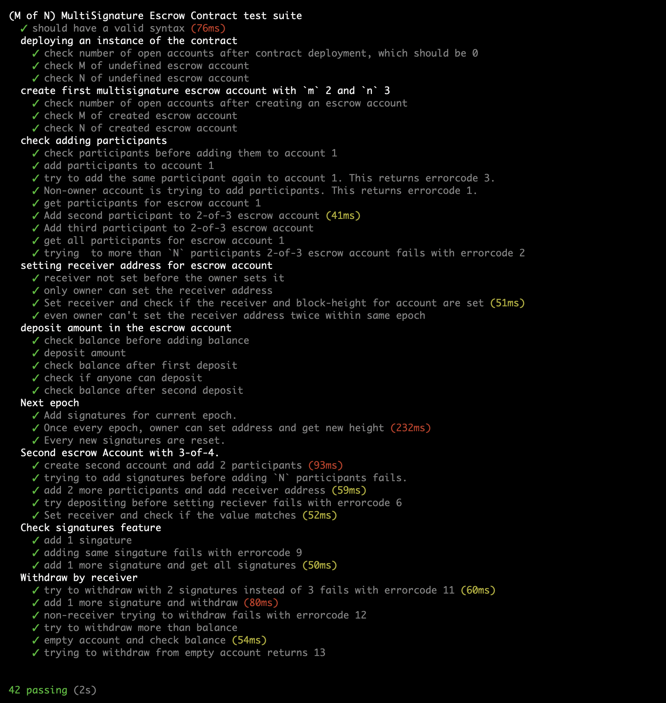

# (M-of-N) Multisignature Escrow Contract
This contract is written in [clarity](https://docs.blockstack.org/core/smart/clarityRef.html) extending basic [escrow@friedger](https://github.com/friedger/clarity-smart-contracts/blob/master/contracts/tokens/escrow.clar) to support multisignature, multiple transactions (i.e. transaction or trade from same account per epoch), consensus of m among n participants. 

## Importance
This escrow contract has functionalities designed for various use-cases. The main idea behind it, is importance of  the consensus of atleast M participants among N for moving the funds in a transparent way.

People providing donation to NGOs and relief committee, put their trust in its members. But due to  bureaucracy, most members doesn't have say in how money is used. By bringing multisignature escrow contract in picture, consensus is required for spending money. 

It can also be used for children' banking account, where atleast one of the parent consent is required for spending fund.    

Millennials have poor savings option (401k or IRA), which doesn't have good yield. Also in crypto due to volatility, FUD happens and even hodlers make wrong decisions. Having a escrow crypto account with let's say 5 friends that require alteast 3 to liquidate 10% crypto to fait.

Other benefit of this escrow contract is participants can decided how to spend money. Funds can be divided in small chunks and participants as a group can decide where to spent them, like 30% on health, 40% on lifestyle and 30% on saving.

### Features:

- Instead of having fixed m and n for escrow, this values can now be defined by users for their use-case. Since clarity doesn't allow list with arbitary length. The upper cap for m and n is 10.

- Any number of escrow accounts can be created. Multiple groups can tune the account with parameters for their use-case.

- Owner (created of the contract) has roles of setting the receiver that's it. Adding funds or the signature (i.e. approving the spending of funds) is controlled by participants.

- Receiver address is set before depositing. Trying to deposit before setting receiver address, will error with `receiver-not-set`. This uses the participants the fixability to backout if the receiver is not whom they want.

- In escrow contract, time is divided in epoch with 10 blocks per epoch. One can think of epoch as round within which participants perform consensus for doing some action.

- Receiver address can be set once per epoch, if the consensus is not there this epoch for sending funds to someone. Owner can change the addres next epoch.

## Outline of contract
### Const data
- `height-per-epoch`: Blockchain time is divided in epoch, per epoch some height is set. Currently there are 10 blocks per epoch. Each epoch is like a round, where receiver address can be set and new signatures are needed for performing new acction. Owner set the receiver address, but if the consensus is not there or by mistake wrong receiver is set, the receiver can be changed after epoch.

### Public functins exposed

#### Getter functions

- `get-open-accounts`: function for geting the total number of open escrow accounts
- `get-participants`: get the list of the participants added by owner for this account. There number is less than or equal to the N set during creation of contract.
-  `get-signatures`: get the signatures, minimum M signatues are required for transferring the funds to the receiver.
- `get-m`: For getting the M, set while creation of contract.
- `get-n`: For getting N parameter of escrow account.
- `get-receiver`: The receiver is the principal to whom we want to transfer funds with consensus of atleast M principal out of N.
- `get-balance`: It is the sum of the deposit done to that account.

#### Setter functions
This functions are capable of modifying the data stored by the contract.

- `create`: Calling this function result in the creation of the contract. The tx-sender is set as the owner of the contract.
- `add-participants`: for adding participants for each account. Participants for each account should be less than N for that account. There is also upper cap on the N which 10
- `add-signatures`: for adding signatures, which are required for approving the transfer of funds to receiver.
- `deposit`: this can be called by anyone to add funds. Keeping it open is important for use-case like a climate relief or health crisis. The general public can deposit to this account if they believe in the majority of participants for spending the funds for mentioned cause.
- `withdraw`: Receiver address set can withdraw funds.
- `set-receiver`: It is done before depositing funds so that participants can backout if they don't funds to be used for this. If consensus is not there, participants can pariticpate again in the next epoch. As once every epoch the receiver address can be changed.

#### Errors
|  Errorcode   |     Meaning                    |
|-----|-----------------------|
|  1 | not-owner-of-account   |
|  2 | participant-length-exceed  |
|  3 | participant-already-present    |
|  4 | account-not-defined    |
|  5 | receiver-already-set   |
|  6 | receiver-not-set   |
|  7 | not-all-participants-added     |
|  8 | is-not-participant     |
|  9 | signature-already-present  |
| 10 | unknown-error      |
| 11 | not-enough-signatures      |
| 12 | not-receiver-of-account    |
| 13 | not-enough-balance     |
| 14 | block-height-not-set |

### Testing module
Clarity is among best contract languages with primarily focus on security and writting robust contract logic. It's project skeleton comes with testing modules.

I have written test for testing various functionalities of the escrow account.

### References

- https://docs.blockstack.org/core/smart/principals.html#example-authorization-checks # for example on how to use fold in clarity
- https://docs.blockstack.org/core/smart/clarityref # documentation of calrity language
- https://github.com/blockstack/clarity-js-sdk # clarity js sdk
- how to write test for clarity # https://docs.blockstack.org/core/smart/tutorial-test.html